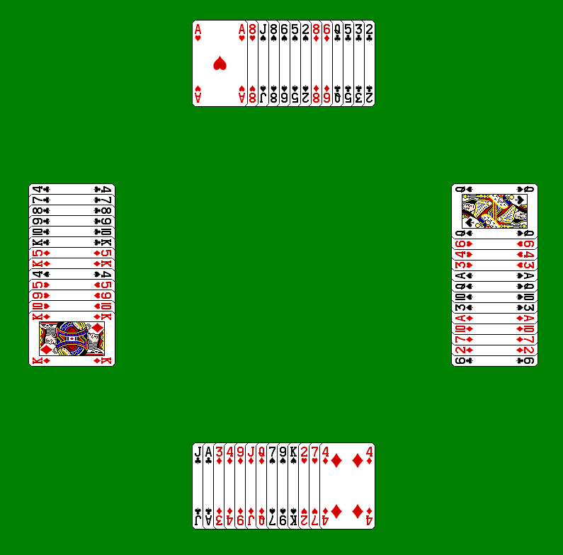

# Hearts

An implementation of the game hearts using a similar programming style as my previous react-minesweeper project.

## TODOS
* Make a primitive game model
* Make an animation system which keeps track of card locations and smoothly transitions them
* Build a simple game menu interface
* Build a responsive game UI using html
* Finish a hearts game model
* Simple some simple computer opponents

## Further Inspiration
* Research more sophisticated AI implementations
* Add a proper backend
* Add user accounts and webpsocket multiplayer
* Add a database and stat tracing
* Add proper ranked play